# Domain Integration & RSAT Administration

## Windows Installation

1. Navigate to Window 10 website and download Windows ISO

2. In Windows 10 setup,
- Select "Create installation media for another PC"
- Select "ISO file" and save Windows ISO file in file explorer
- Finish Setup
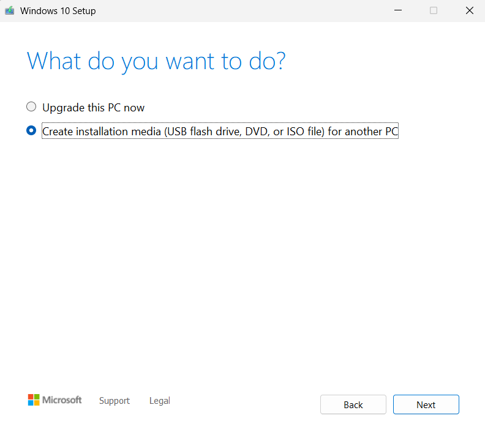

## Windows Virtual Machine Setup

1. Open VirtualBox
- Create new Virtual Machine
- Setup VM Operating System, password and specify virtual hardware and diskware

- Power on VM
- Add downloaded Windows ISO image To Boot up Windows

### Windows Desktop Experience Setup

1. In Windows Setup,
- Select with Windows 10 Pro
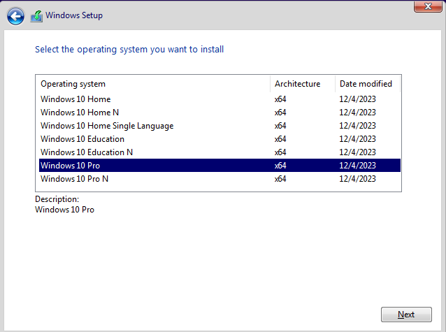

- Select "Custom Install Windows only"
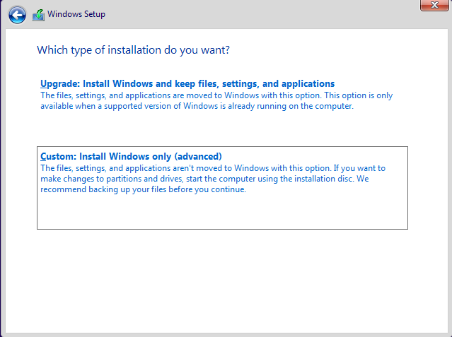

- Proceed With Default Setup

2. In Basic Setup,
- Select "Setup for personal use"

- Select "Offline account"
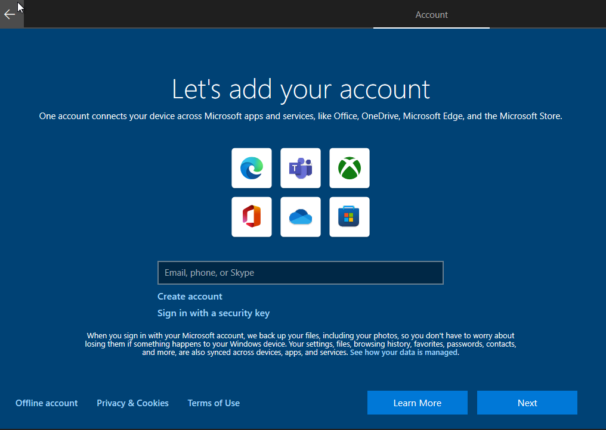

- Select "Limited Experience"

- Create User with no password

- Proceed with default setup

### Administrator Setup
1. To enable admin account, navigate to file explorer -> right-click "This PC" -> "Manage" -> "Local User and Groups" -> Users -> right-click on Administrator -> "Properties"
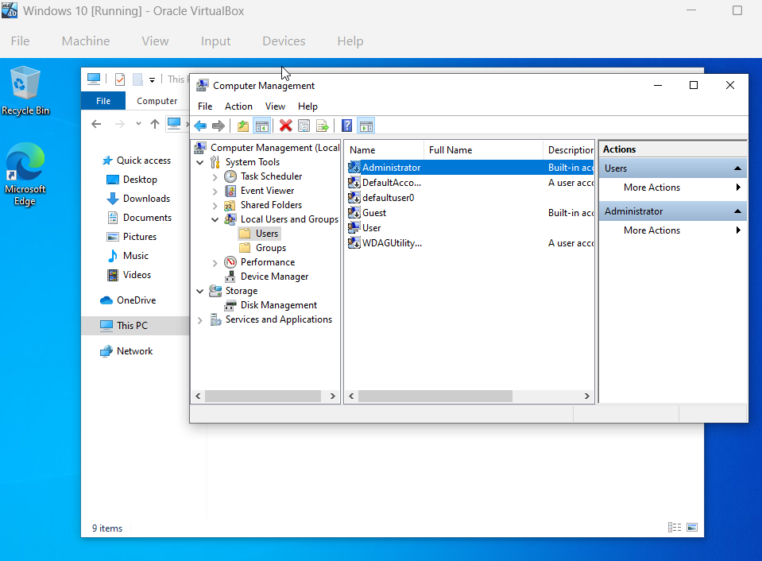

2. In Administrator Properties, select "Password never expires" and click "OK"
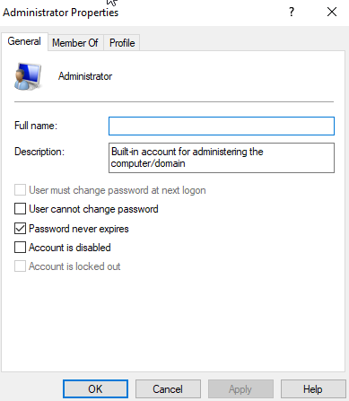

3. Right-click Administrator -> "set Password" -> create password

4. Sign out of user account(local) and Log in as Administrator account

5. To remove local account, navigate to file explorer -> right-click "This PC" -> "Manage" -> "Local User and Groups" -> Users -> right-click on Local Account (User) -> "Delete"
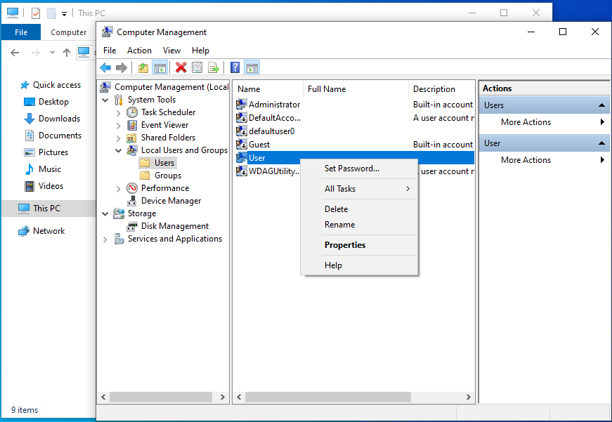

## Windows RSAT Installation (Server Manager) and Renaming Computer
Note: As a helpdesk/IT support, RSAT tools like server manager may not be given due to advanced access

1. Navigate to "System" -> Optional features(On Left Panel) -> select "Add a feature"
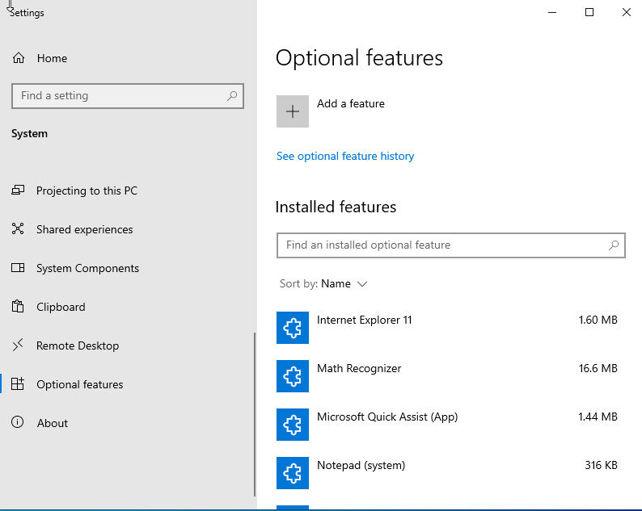

2. Select the following RSAT Tools: 
- Active Directory Certificate Services Tools
- Active Directory Domain Services and Lightweight Directory Services Tools
- DHCP Server Tools
- DNS Server Tools
- Group Policy Management Tools
- Remote Desktop Services Tools
- Server Manager
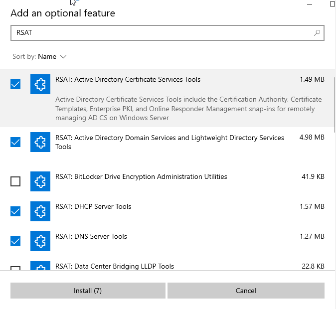

3. To rename Windows Computer, navigate to file explorer -> right-click "This PC" -> Properties -> "Rename This PC"
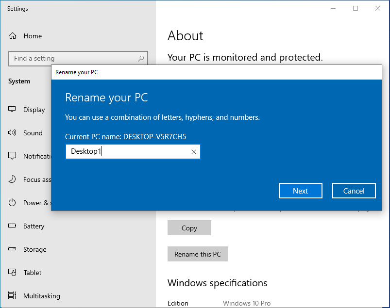

## Installing TeamViewer to Windows VM

1. In Windows VM,
- Navigate to TeamViewer download website and download TeamViewer for Windows
- Install default setup for TeamViewer
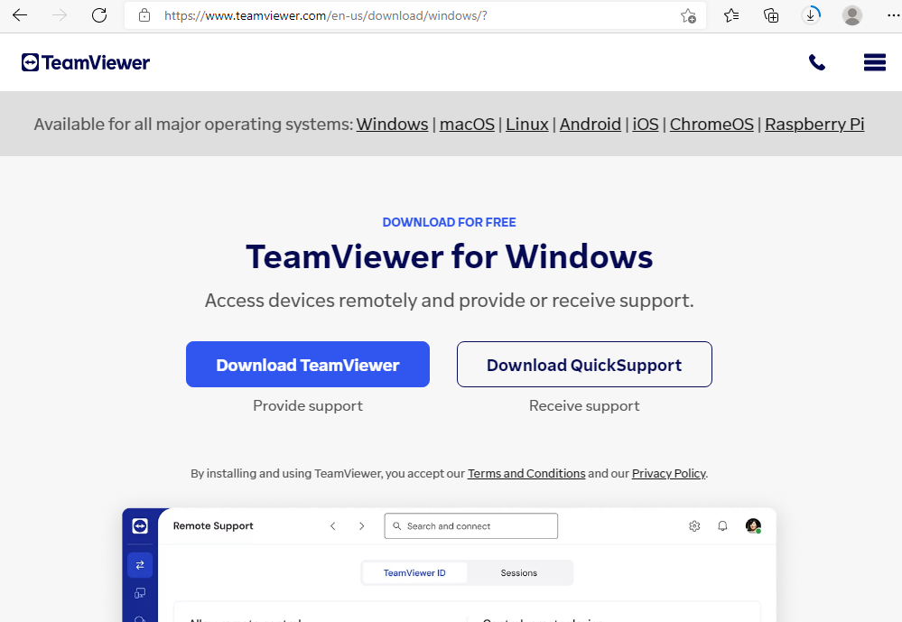

## Add Computer to Domain (Connect Windows Client to Windows Server)

1. To create a static IP address, navigate to Control Panel -> select "Network and Internet: View network status and tasks" -> "change adapter settings" -> "Ethernet" -> "Properties" -> select "TCP/IPV4"

2. In TCP/IPV4 properties,
- select "use the following IP address"
- Fill in the following IP address and DNS server address credentials
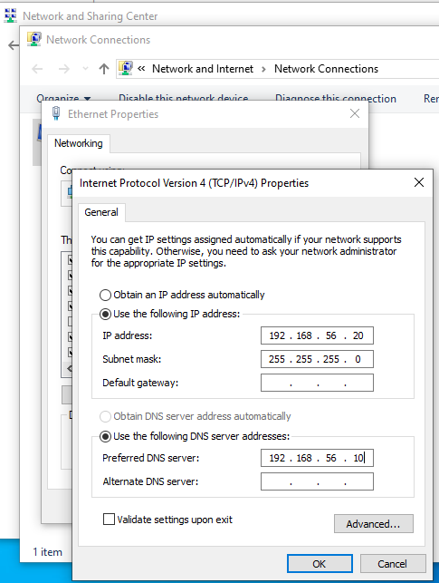

3. Navigate to Devices (Top Panel) -> Network -> Network Settings -> Change Network Adapter to "Host-only Adapter" (This should be done for both Windows VM and Windows Server VM)
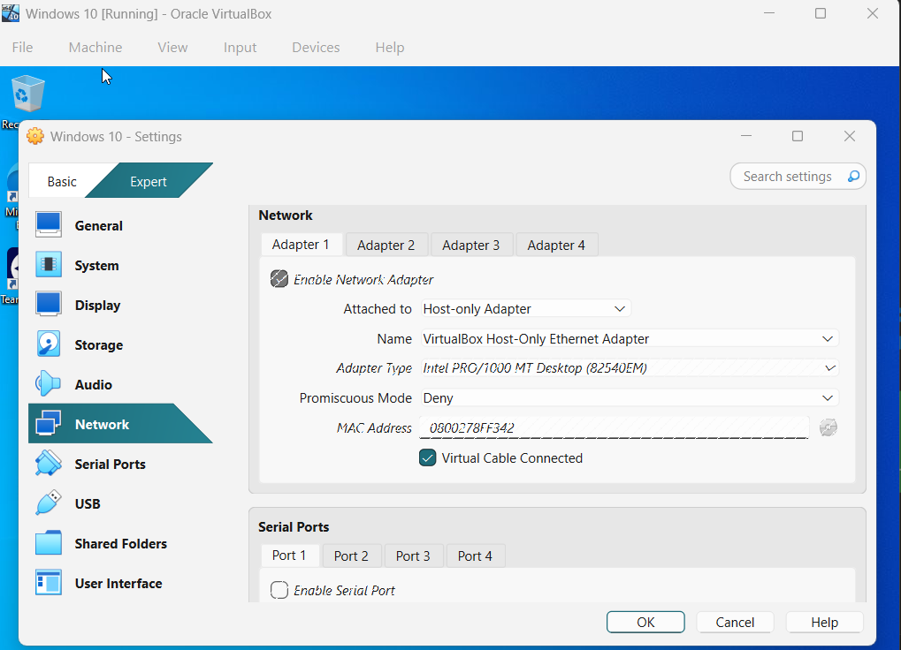

4. Navigate to File explorer -> right-click "This PC" -> Properties -> "Rename This PC (advanced)" -> Change -> Select "domain", add domain name and enter admin credentials
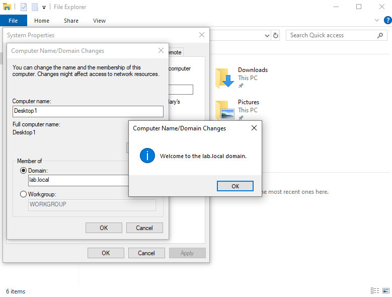

5. To Confirm domain integration is successful, try logging in with a a User accounted created in the Windows Server Domain (Ex: helpdesk)
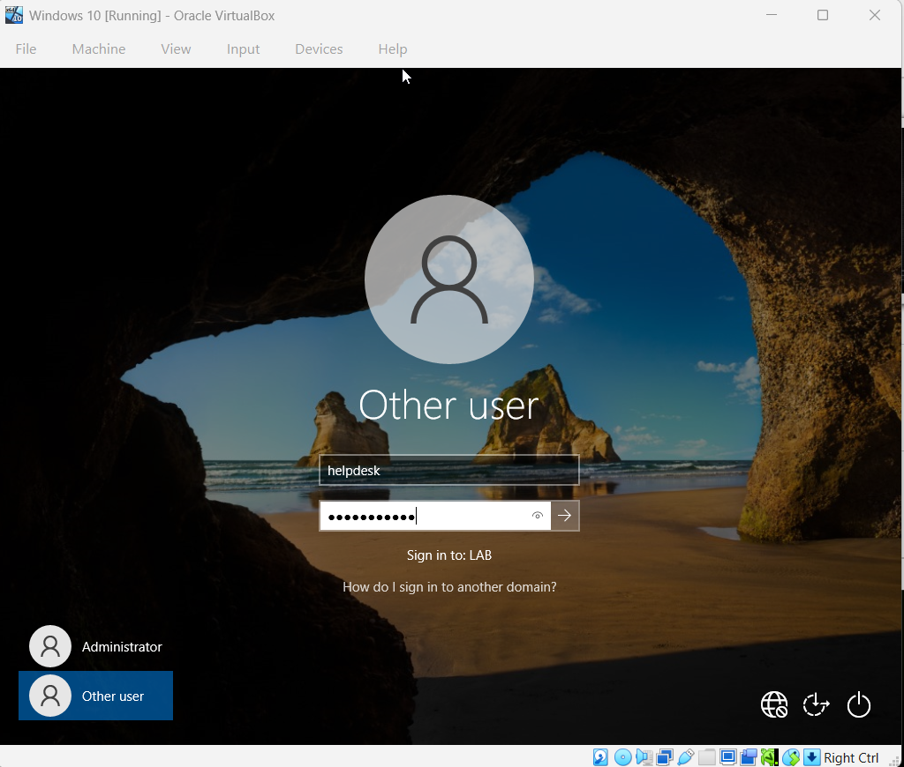