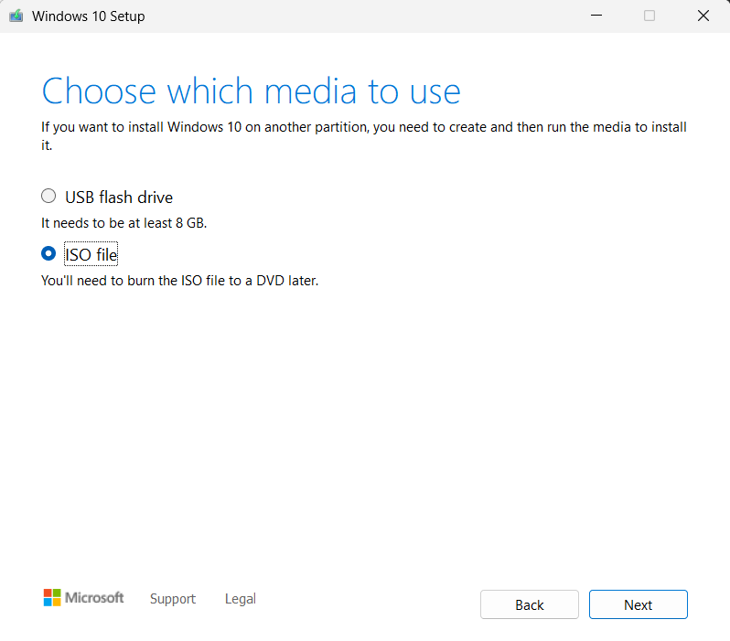
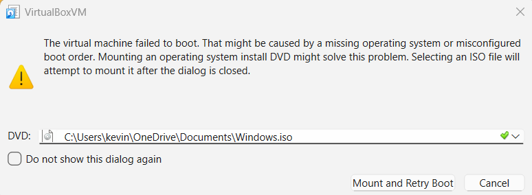
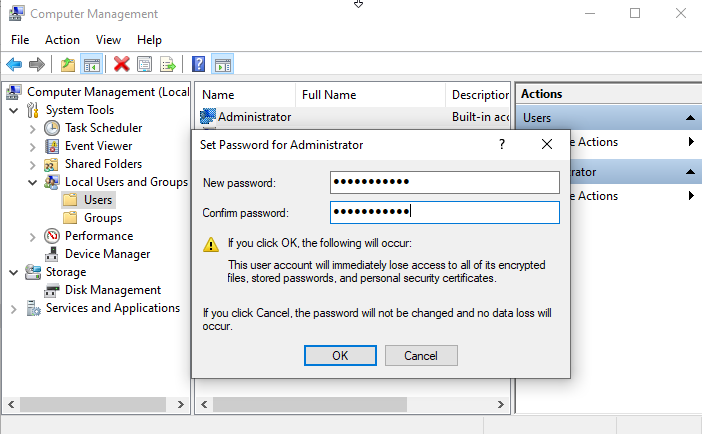

# Domain Integration & RSAT Administration

## Windows Installation

1. Navigate to Window 10 website and download Windows ISO

2. In Windows 10 setup,
- Select "Create installation media for another PC"
- Select "ISO file" and save Windows ISO file in file explorer
- Finish Setup

## Windows Virtual Machine Setup

1. Open VirtualBox
- Create new Virtual Machine
- Setup VM Operating System, password and specify virtual hardware and diskware

- Power on VM
- Add downloaded Windows ISO image To Boot up Windows

### Windows Desktop Experience Setup

1. In Windows Setup,
- Select with Windows 10 Pro

- Select "Custom Install Windows only"

- Proceed With Default Setup

2. In Basic Setup,
- Select "Setup for personal use"

- Select "Offline account"

- Select "Limited Experience"

- Create User with no password

- Proceed with default setup

### Administrator Setup
1. To enable admin account, navigate to file explorer -> right-click "This PC" -> "Manage" -> "Local User and Groups" -> Users -> right-click on Administrator -> "Properties"

2. In Administrator Properties, select "Password never expires" and click "OK"

3. Right-click Administrator -> "set Password" -> create password

4. Sign out of user account(local) and Log in as Administrator account

5. To remove local account, navigate to file explorer -> right-click "This PC" -> "Manage" -> "Local User and Groups" -> Users -> right-click on Local Account (User) -> "Delete"
pic

## Windows RSAT Installation (Server Manager)
Note: As a helpdesk/IT support, RSAT tools like server manager may not be given due to advanced access

1. Navigate to "add or remove programs" -> "Optional features" -> "Add a feature"
pic

2. Select the following RSAT Tools: 
- Active Directory Certificate Services Tools
- Active Directory Domain Services and Lightweight Directory Services Tools
- DHCP Server Tools
- DNS Server Tools
- Group Policy Management Tools
- Remote Desktop Services Tools
- Server Manager
pic