# Security Groups, Map Drives and Personal Drives

## Security Groups
Security groups - virtual firewall that controls the flow of network traffic—both incoming (inbound) and outgoing (outbound)—to and from a specific group of user accounts.

### Shared Drive Permissions (HR and Personal) on Windows Server 2016
Shared Drive Permissions - rules that define who can access a file or folder that's been made available to others over a network, and what they are allowed to do with it (e.g., view, edit, or delete).

1. Navigate to Server Manager -> File and Storage Services -> right-click "Shares" -> new Share
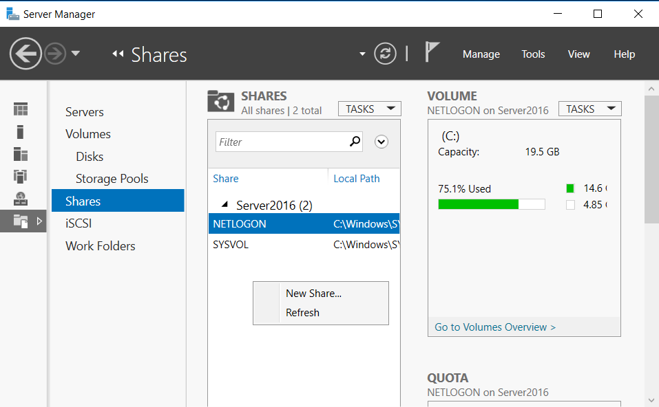

2. In New Share Wizard, 
- In Share Location, "Select by Volume"
- In "Share Name" specify name of group to share with
- Leave Default options, and click "Create" and "Close

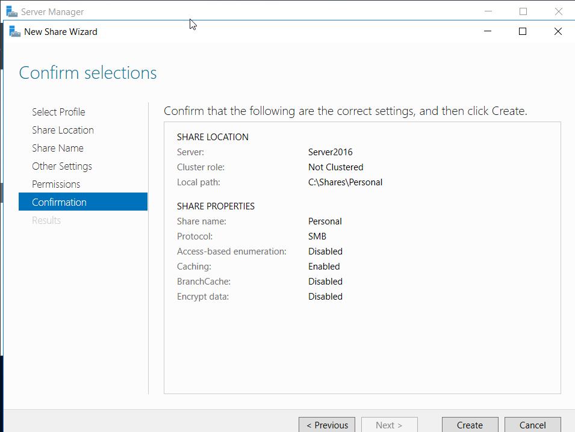

3. To view shared folders, navigate to File Explorer -> "This PC" -> Local Disk -> Shares

### Creating Security Groups (HR and Personal)
Note: I
- Security Group - Gives access to resources, like files, folders, applications, or emails.
- Distribution Group - Used to only send emails to a group of people.

1. Navigate to Server Manager -> Tools -> Active Directory Users and Computers -> Domain(Ex: lab.local) -> right-click "Users -> New -> Group

2. In New Object - Group, 
- Create Group Name (Ex: "HR")
- Select Group Type : Security
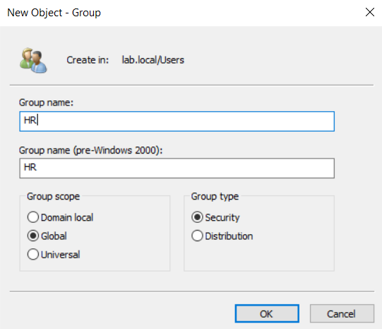

### Add Users to Security Groups

1. Navigate to "Active Directory Users and Computers" -> Domain(Ex: lab.local) -> Users -> select Security Group (Ex: "HR") -> "Members" tab -> Add -> find and add desired user (Ex: danny)
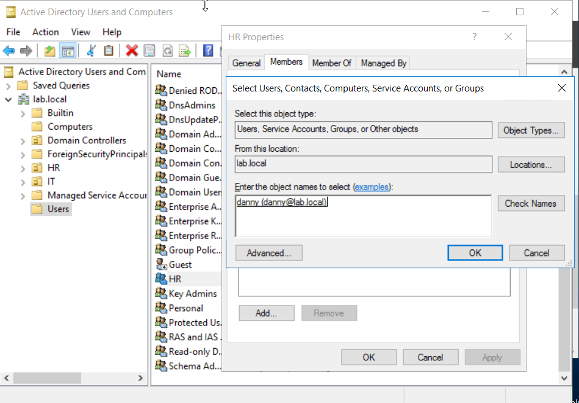 

2. To confirm what Security groups a user is apart of, select User -> "Member of" tab
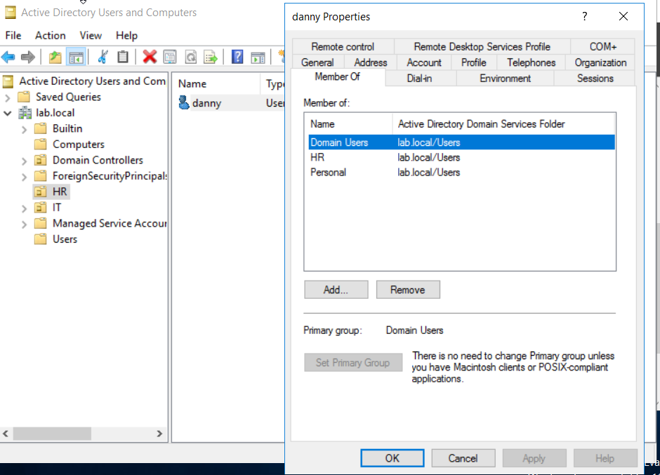 

### Folder Permissioning
Folder Permissioning- process of setting rules that define who can access a folder and its contents, and what actions they are allowed to perform (like viewing, editing, or deleting files).

1. Right-click Shared Folder(Ex: Personal) -> Properties -> "Security" tab -> Advanced -> select "Disable Inheritance" -> select "Convert inherited permissions into explicit permissions"

2. In "Advanced Security Settings",
- Select "Remove" to get rid of unneccessary Users 
- Select "Add" -> "Select a Principal", to give user permission (Ex: helpdesk)

3. To give security group read/write permissions, navigate to Shared Folder(Ex: Personal) -> right-click Folder -> select Properties -> "Sharing" tab -> "Share" -> Give Security Group Permission (Read/Write)
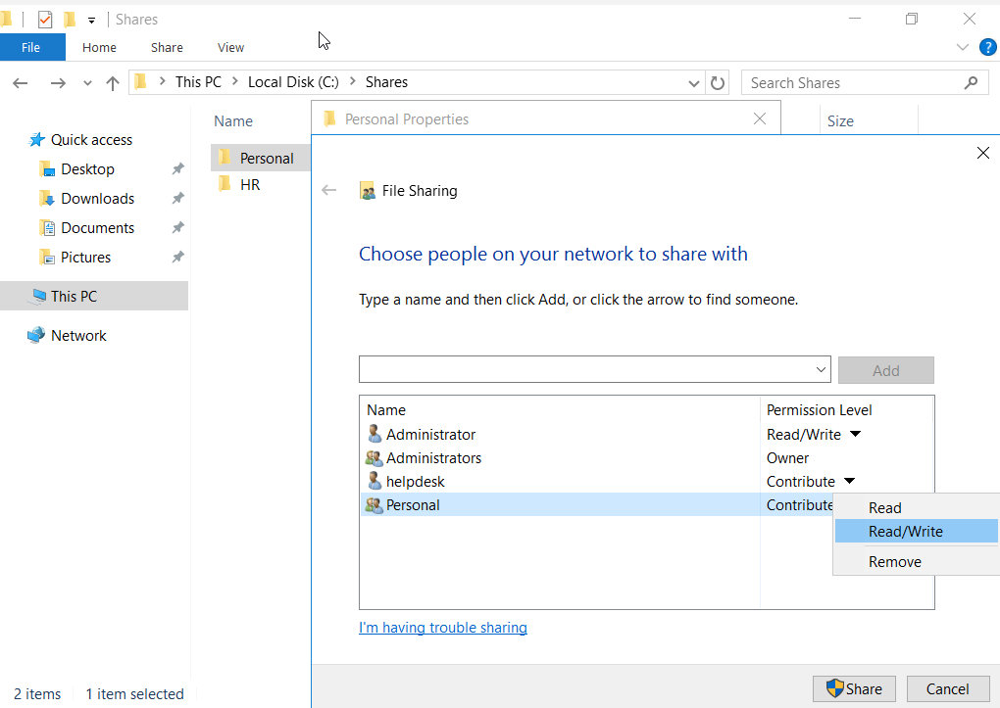

## Map Drives 
Map Drives - shortcut created on a computer that points to a shared folder on another computer or server on a local network.

### Mapping Drive with User account in Desktop 2

1. Log in as User is part of the security group (Ex: "HR" group has access to "HR" folder, and "danny" is apart of the "HR" group, therefore "danny" has access to "HR" folder)
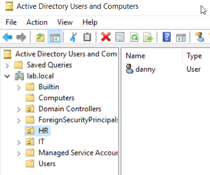
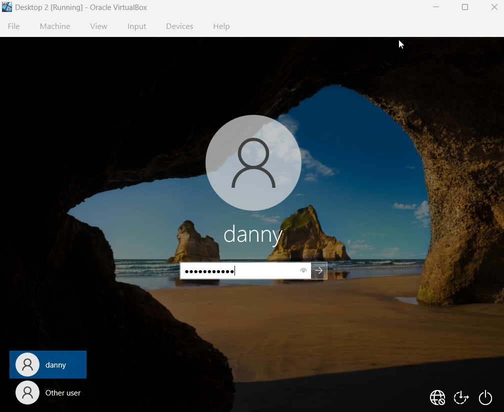

2. Navigate to "File Explorer", find network drive path to the shared folder (Ex: "hr" folder) and copy it (network drive path can be found in Shared Folder properties in Windows Server)
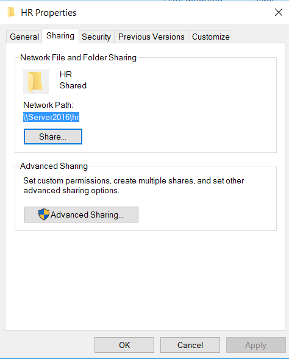
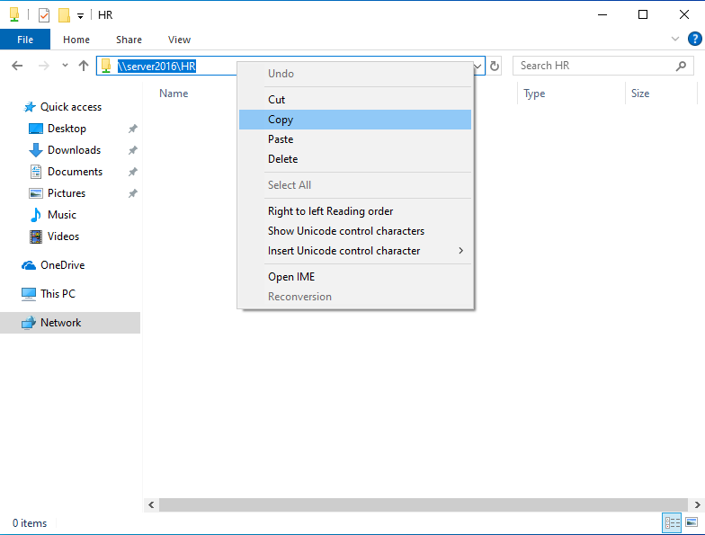

3. Right-click "This PC" -> "Map network drive" -> paste network path into "Folder" section
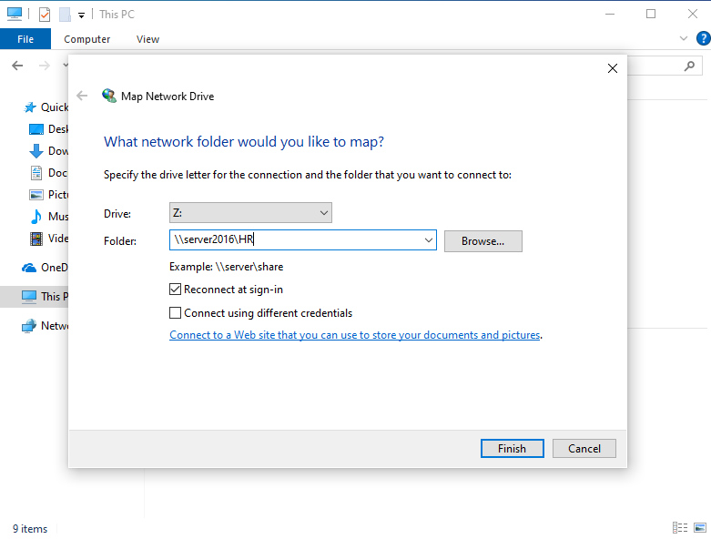

4. Mapped Drive would be under "Devices and Drives" in the File Explorer
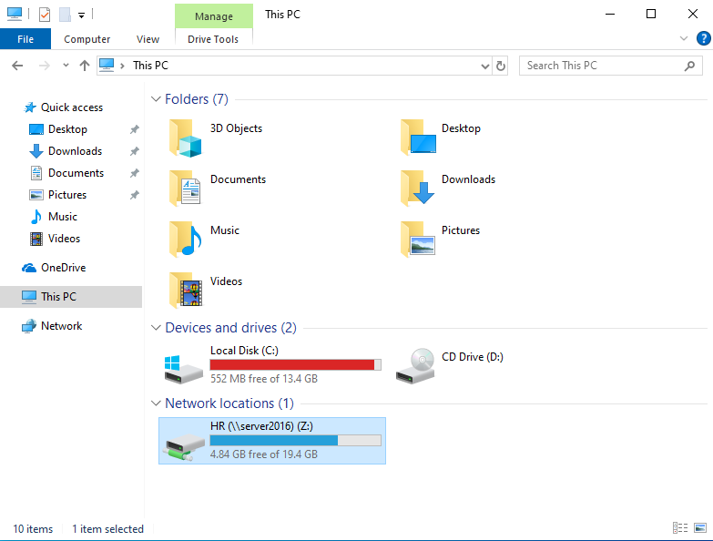

### Mapping Drive with Admin account in Windows Server

1. Log into Administrator account in Windows Server

2. Navigate to "Active Directory User and Computers" -> select User(Ex: danny)
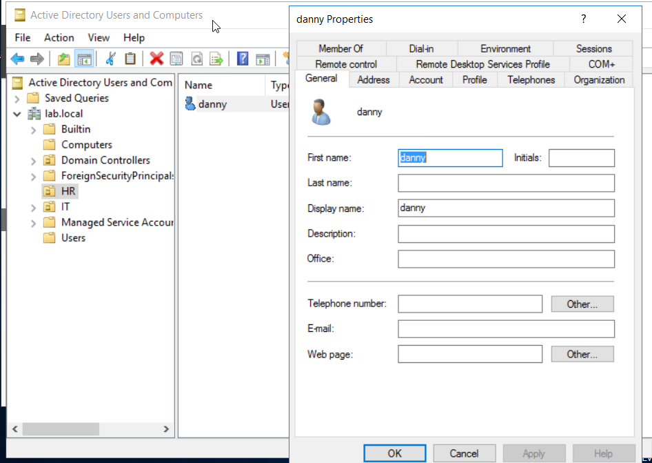

3. In User properties -> "Profile" tab, 
- In "Home folder", select "Connect" and enter "domain\shared folder\%username%" (Ex: "\\Server2016\Personal\%username%")
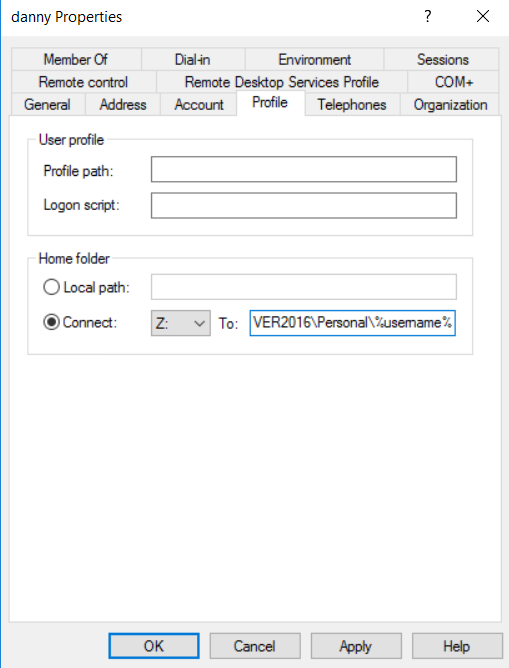

4. To confirm Drive is mapped, Log into user account(in Desktop 2), and mapped drive should be under "Devices and Drives" in the File Explorer
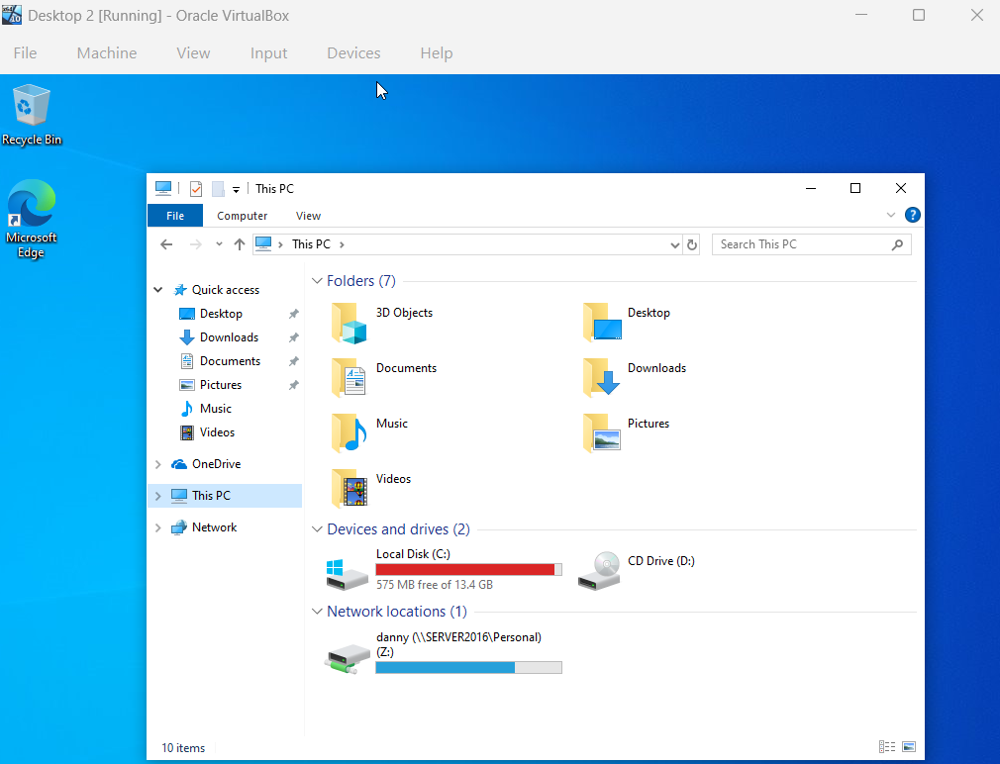
