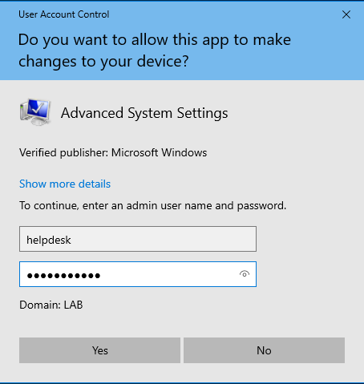
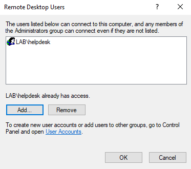
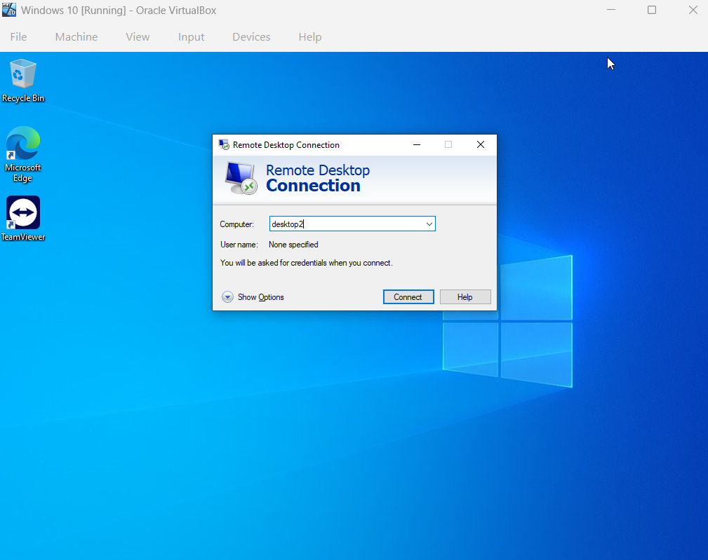
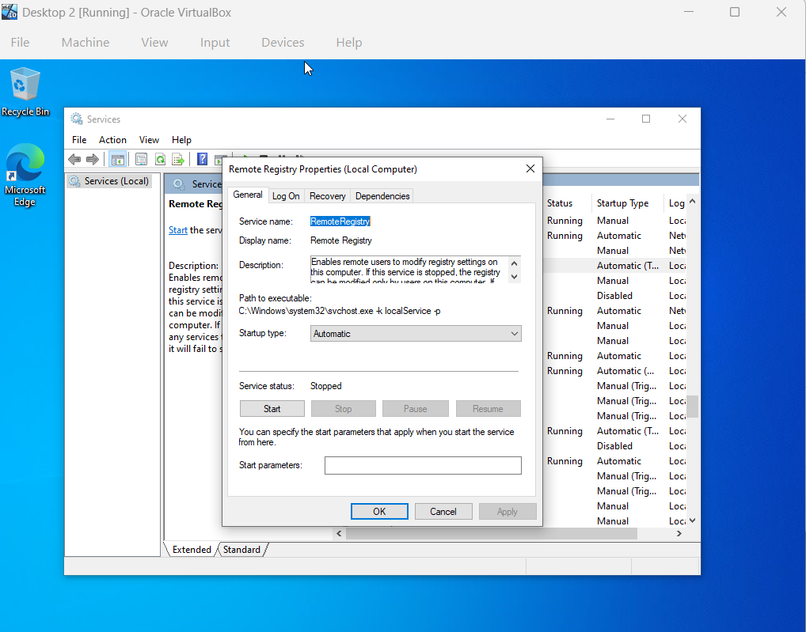
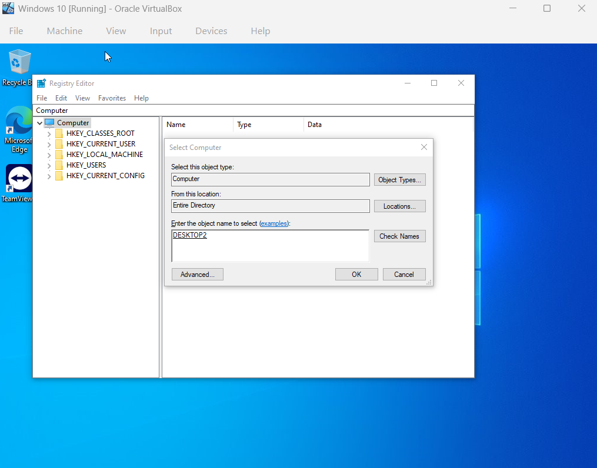
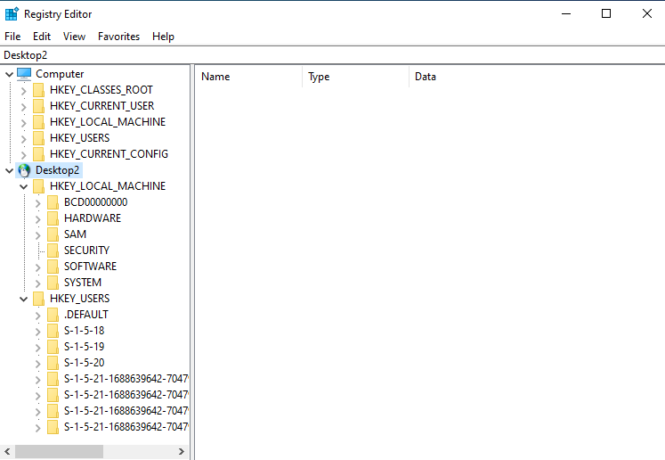

# Windows Remote/ Remote Registry / Remote Desktop / C$

## Remote Desktop
Remote Desktop - Technology that allows a user to access and control a computer or server from a different physical location using a separate device, often called the "client," over a network connection (like a local network or the internet).

### Enable Remote Desktop on Desktop 2(User Account)

1. Navigate to File Explorer -> right-click "This PC" -> Properties -> select Advanced system settings and use admin credentials to allow changes/access(ex: "helpdesk" admin)

2. In System Properties -> "Remote" tab, 
- Select "Allow remote connections to this computer"
- In "Select Users", verify admin has access by adding to "Remote Desktop Users

3. To confirm Remote Desktop Remote is enabled,
- Log into Windows Client (Desktop 1) as helpdesk admin
- Navigate to "Remote Desktop Connection"

- Connect to Desktop 2 (name: desktop2) with admin credentials for access

- Both Machines would have to verify to connection, and once verified the user account (Ex: danny) will be logged out and admin(ex:helpdesk) would have access to the users files and much more.

### Advantages of Remote Desktop (Admin(Desktop 1) using Remote Desktop on User(Desktop 2))

1. To Access the Users Files while on Remote Desktop, navigate to File Explorer -> "This PC" -> Local Disk -> Users -> User Account (Ex: danny)

2. Remote Desktop Advantages include,
- Remote Access to Work Systems
- Faster Troubleshooting and Support
- Secure Connections
- Increased Productivity
- Cost Savings

## Remote Registry 
Windows Registry - database that stores all the important settings and configurations for your computer’s operating system, hardware, software, and user accounts.

Remote Registry - Lets IT admins view or edit another computer’s registry remotely, mainly for management or troubleshooting

### Determining Share Drives with Remote Registry

1. To enable Remote Registry, in User account (Desktop 2),
- Navigate to "Services"(run as adminisitrator and use admin credentials to access) -> Remote Registry
- In Remote Registry Properties, make "Startup type: Automatic", "apply" and select "start"

2. To use Remote Registry, in Admin account (desktop 1),
- Navigate to Registry Editor -> File -> "Connect Network Registry"
- In "Select Computer", add desktop to Remote to(Ex: desktop2)

3. Using Remote Registry, the Admin can access the user's(desktop2) shared drives and much more.

## Windows Remote

